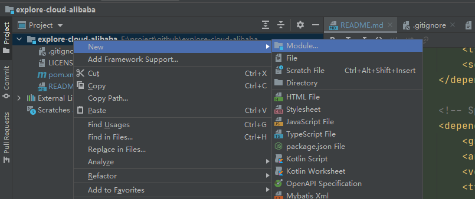
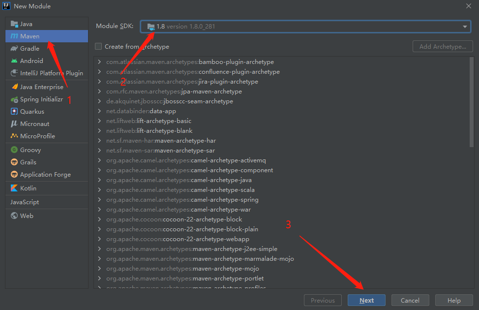
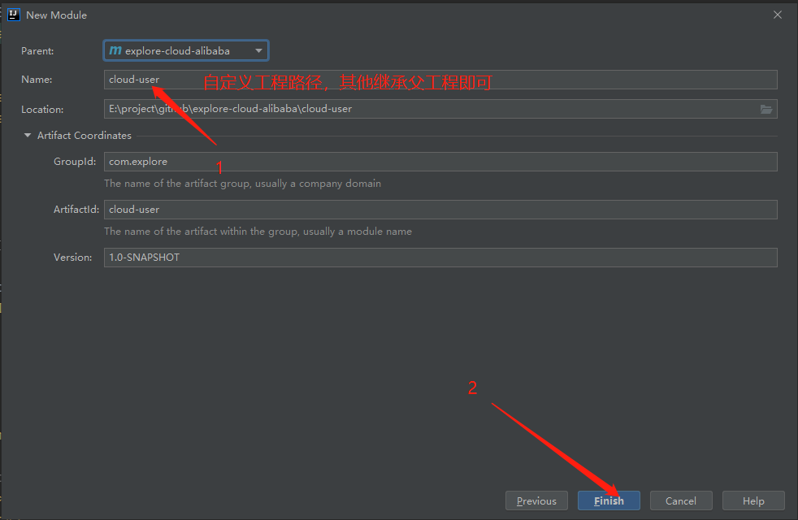
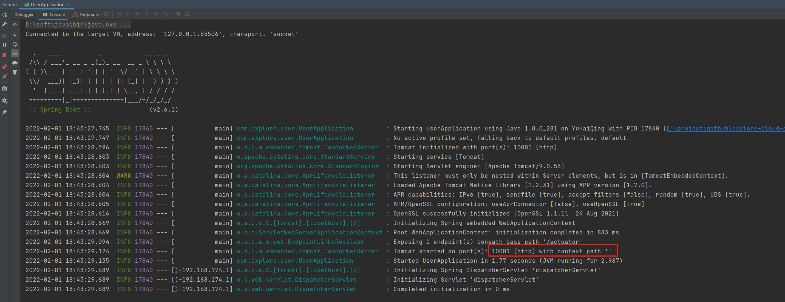
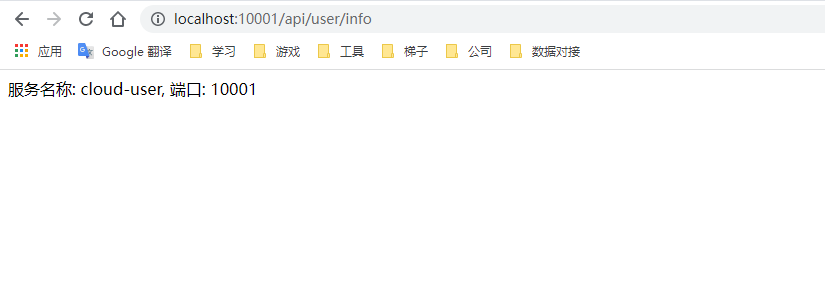
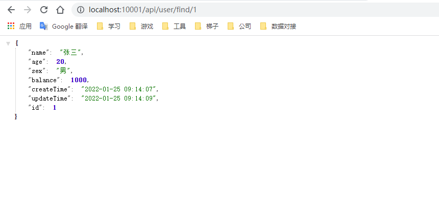

# explore-cloud-alibaba
探索 Spring Cloud 集成 Alibaba 

## 第一步: 配置父工程
```xml
<?xml version="1.0" encoding="UTF-8"?>
<project xmlns="http://maven.apache.org/POM/4.0.0"
         xmlns:xsi="http://www.w3.org/2001/XMLSchema-instance"
         xsi:schemaLocation="http://maven.apache.org/POM/4.0.0 http://maven.apache.org/xsd/maven-4.0.0.xsd">
    <modelVersion>4.0.0</modelVersion>

    <groupId>com.explore</groupId>
    <artifactId>explore-cloud-alibaba</artifactId>
    <version>1.0-SNAPSHOT</version>
    <modules>
        <module>cloud-user</module>
    </modules>
    <packaging>pom</packaging>

    <properties>
        <maven.compiler.source>8</maven.compiler.source>
        <maven.compiler.target>8</maven.compiler.target>
    </properties>


    <dependencies>

        <!-- Lombok 依赖 -->
        <dependency>
            <groupId>org.projectlombok</groupId>
            <artifactId>lombok</artifactId>
        </dependency>

    </dependencies>


    <dependencyManagement>

        <!-- Spring Boot 相关依赖 -->
        <dependencies>
            <dependency>
                <groupId>org.springframework.boot</groupId>
                <artifactId>spring-boot-dependencies</artifactId>
                <version>2.6.1</version>
                <type>pom</type>
                <scope>import</scope>
            </dependency>

            <!-- Spring Cloud 相关依赖 -->
            <dependency>
                <groupId>org.springframework.cloud</groupId>
                <artifactId>spring-cloud-dependencies</artifactId>
                <version>2021.0.0</version>
                <type>pom</type>
                <scope>import</scope>
            </dependency>

            <!-- Spring Cloud Alibaba 相关依赖 -->
            <dependency>
                <groupId>com.alibaba.cloud</groupId>
                <artifactId>spring-cloud-alibaba-dependencies</artifactId>
                <version>2021.1</version>
                <type>pom</type>
                <scope>import</scope>
            </dependency>

            <!-- MySql 驱动 -->
            <dependency>
                <groupId>mysql</groupId>
                <artifactId>mysql-connector-java</artifactId>
                <version>8.0.20</version>
            </dependency>

            <!-- Spring Boot Mybatis 相关依赖 -->
            <dependency>
                <groupId>org.mybatis.spring.boot</groupId>
                <artifactId>mybatis-spring-boot-starter</artifactId>
                <version>2.2.0</version>
            </dependency>

            <!-- 数据库连接池 -->
            <dependency>
                <groupId>com.alibaba</groupId>
                <artifactId>druid-spring-boot-starter</artifactId>
                <version>1.2.8</version>
            </dependency>

            <!-- 工程热部署依赖 -->
            <dependency>
                <groupId>org.springframework.boot</groupId>
                <artifactId>spring-boot-devtools</artifactId>
                <version>2.6.1</version>
            </dependency>

        </dependencies>

    </dependencyManagement>

    <build>
        <plugins>
            <plugin>
                <groupId>org.springframework.boot</groupId>
                <artifactId>spring-boot-maven-plugin</artifactId>
                <configuration>
                    <fork>true</fork>
                </configuration>
            </plugin>
        </plugins>
    </build>

</project>
```

## 第二步：创建子工程（普通的maven工程）

### 创建 cloud-user 子工程
#### 1. 创建maven工程


#### 2. 选择SDK


#### 3. 设置子工程名称


#### 4. 配置子工程中的相关依赖
```xml
<?xml version="1.0" encoding="UTF-8"?>
<project xmlns="http://maven.apache.org/POM/4.0.0"
         xmlns:xsi="http://www.w3.org/2001/XMLSchema-instance"
         xsi:schemaLocation="http://maven.apache.org/POM/4.0.0 http://maven.apache.org/xsd/maven-4.0.0.xsd">
    <parent>
        <artifactId>explore-cloud-alibaba</artifactId>
        <groupId>com.explore</groupId>
        <version>1.0-SNAPSHOT</version>
    </parent>
    <modelVersion>4.0.0</modelVersion>

    <artifactId>cloud-user</artifactId>

    <properties>
        <maven.compiler.source>8</maven.compiler.source>
        <maven.compiler.target>8</maven.compiler.target>
    </properties>

    <dependencies>

        <!-- web工程依赖 -->
        <dependency>
            <groupId>org.springframework.boot</groupId>
            <artifactId>spring-boot-starter-web</artifactId>
        </dependency>
        <!-- Spring Boot 程序监控器 -->
        <dependency>
            <groupId>org.springframework.boot</groupId>
            <artifactId>spring-boot-starter-actuator</artifactId>
        </dependency>

    </dependencies>

</project>
```

#### 5. 创建 application.yaml,并且配置服务名称与端口
```yaml
server:
  port: 10001

spring:
  application:
    name: cloud-user
```

#### 6. 创建 启动类 与 控制器类

##### 启动类 UserApplication
```java

package com.explore.user;

import org.springframework.boot.SpringApplication;
import org.springframework.boot.autoconfigure.SpringBootApplication;

/**
 * 用户服务 启动类
 *
 * @author: YuHaiQing
 * @time: 2022/2/1 18:40
 */
@SpringBootApplication
public class UserApplication {

    public static void main(String[] args) {
        SpringApplication.run(UserApplication.class,args);
    }

}
```

##### 控制器类 UserController
```java
package com.explore.user.controller;

import org.springframework.beans.factory.annotation.Value;
import org.springframework.web.bind.annotation.GetMapping;
import org.springframework.web.bind.annotation.RequestMapping;
import org.springframework.web.bind.annotation.RestController;

/**
 * 用户 控制器类
 *
 * @author: YuHaiQing
 * @time: 2022/2/1 18:40
 */
@RestController
@RequestMapping("/api/user")
public class UserController {

    @Value("${server.port}")
    private Integer port;

    @GetMapping("/info")
    public String info(){
        return "服务名称: cloud-user, 端口: " + port;
    }
    
}
```

#### 7. 启动 用户服务


#### 8. 访问接口


#### 9. 按照创建用户服务的步骤，创建 产品服务 与 订单服务


### 第三步：编写实体Bean，对象关系映射，连接数据源

#### 1. 创建实体Bean
```java
package com.explore.user.domain;

import com.fasterxml.jackson.annotation.JsonFormat;
import lombok.AllArgsConstructor;
import lombok.Data;
import lombok.NoArgsConstructor;

import java.io.Serializable;
import java.math.BigDecimal;
import java.time.LocalDateTime;

/**
 * 用户 实体类
 *
 * @author: YuHaiQing
 * @time: 2022/2/1 19:10
 */
@Data
@NoArgsConstructor
@AllArgsConstructor
public class User implements Serializable {

    /**
     * 主键
     */
    private Long Id;

    /**
     * 用户姓名
     */
    private String name;

    /**
     * 用户年龄
     */
    private Integer age;

    /**
     * 用户性别
     */
    private String sex;

    /**
     * 用户账户余额
     */
    private BigDecimal balance;

    /**
     * 创建时间
     */
    @JsonFormat(pattern = "yyyy-MM-dd HH:mm:ss")
    private LocalDateTime createTime;

    /**
     * 更新时间
     */
    @JsonFormat(pattern = "yyyy-MM-dd HH:mm:ss")
    private LocalDateTime updateTime;

}

```

#### 2. 创建 实体Bean对应的Mapper 接口
```java
package com.explore.user.mapper;

import com.explore.user.domain.User;
import org.apache.ibatis.annotations.Mapper;
import org.apache.ibatis.annotations.Param;

import java.math.BigDecimal;

/**
 * 用户映射器
 *
 * @author: YuHaiQing
 * @time: 2022/2/1 19:14
 */
@Mapper
public interface UserMapper {

    /**
     * 根据用户Id查询用户信息
     *
     * @param userId 用户Id
     *
     * @author: HaiQing.Yu
     * @time: 2022/2/1 19:15
     */
    User getById(@Param("userId") Long userId);

    /**
     * 扣余额
     *
     * @param userId 用户Id
     * @param money 扣款金额
     *
     * @author: HaiQing.Yu
     * @time: 2022/2/1 19:16
     */
    Integer reduction(@Param("userId") Long userId, @Param("money") BigDecimal money);

}
```

#### 3. 创建 Mapper接口对应的*Mapper.xml 文件
```xml
<?xml version="1.0" encoding="UTF-8"?>
<!DOCTYPE mapper PUBLIC "-//mybatis.org//DTD Mapper 3.0//EN" "http://mybatis.org/dtd/mybatis-3-mapper.dtd">

<mapper namespace="com.explore.user.mapper.UserMapper">

    <resultMap id="userMap" type="com.explore.user.domain.User">
        <id column="id" jdbcType="BIGINT" property="id" javaType="java.lang.Long" />
        <result column="name" jdbcType="VARCHAR" property="name" javaType="java.lang.String" />
        <result column="age" jdbcType="INTEGER" property="age" javaType="java.lang.Integer" />
        <result column="sex" jdbcType="VARCHAR" property="sex" javaType="java.lang.String" />
        <result column="balance" jdbcType="DECIMAL" property="balance" javaType="java.math.BigDecimal" />
        <result column="create_time" jdbcType="TIMESTAMP" property="createTime" javaType="java.time.LocalDateTime" />
        <result column="update_time" jdbcType="TIMESTAMP" property="updateTime" javaType="java.time.LocalDateTime" />
    </resultMap>
    
    <!-- 新增用户 -->
    <insert id="insert" useGeneratedKeys="true" keyColumn="id">
        insert into e_user (name,age,sex,balance,create_time,update_time) values (#{name},#{age},#{sex},#{balance},#{createTime},#{updateTime})
    </insert>

    <!-- 根据用户Id查询用户信息 -->
    <select id="findById" resultMap="userMap">
        select id,name,age,sex,balance,create_time,update_time from e_user where id = #{userId}
    </select>

    <!-- 扣款操作 -->
    <update id="deduction">
        update e_user set balance = balance - #{money} where id = #{userId}
    </update>

</mapper>
```

#### 4. 编写具体业务逻辑
```java
package com.explore.user.service;

import com.explore.user.domain.User;

import java.math.BigDecimal;

/**
 * 用户 业务逻辑接口类
 *
 * @author: HaiQing.Yu
 * @time: 2022/2/1 20:55
 */
public interface IUserService {

    /**
     * 根据用户Id查询用户信息
     *
     * @author: HaiQing.Yu
     * @time: 2022/2/1 20:56
     */
    User getById(Long userId);

    /**
     * 扣款
     *
     * @author: HaiQing.Yu
     * @time: 2022/2/1 20:57
     */
    Boolean reduction(Long userId, BigDecimal money);

}
```

```java
package com.explore.user.service.impl;

import com.explore.user.domain.User;
import com.explore.user.mapper.UserMapper;
import com.explore.user.service.IUserService;
import org.springframework.stereotype.Service;

import javax.annotation.Resource;
import java.math.BigDecimal;

/**
 * 用户服务 业务逻辑实现类
 *
 * @author: YuHaiQing
 * @time: 2022/2/1 20:57
 */
@Service
public class UserServiceImpl implements IUserService {

    @Resource
    private UserMapper userMapper;

    @Override
    public User getById(Long userId) {
        return userMapper.getById(userId);
    }

    @Override
    public Boolean reduction(Long userId, BigDecimal money) {

        Integer reduction = userMapper.reduction(userId, money);

        if(null != reduction && reduction > 0){
            return Boolean.TRUE;
        }
        return Boolean.FALSE;
    }
}
```

```java
package com.explore.user.controller;

import com.explore.user.domain.User;
import com.explore.user.service.IUserService;
import org.springframework.beans.factory.annotation.Value;
import org.springframework.web.bind.annotation.GetMapping;
import org.springframework.web.bind.annotation.PathVariable;
import org.springframework.web.bind.annotation.RequestMapping;
import org.springframework.web.bind.annotation.RestController;

import javax.annotation.Resource;

/**
 * 用户 控制器类
 *
 * @author: YuHaiQing
 * @time: 2022/2/1 18:40
 */
@RestController
@RequestMapping("/api/user")
public class UserController {

    @Value("${server.port}")
    private Integer port;

    @Resource
    private IUserService userService;

    @GetMapping("/info")
    public String info(){
        return "服务名称: cloud-user, 端口: " + port;
    }


    @GetMapping("/find/{userId}")
    public User getById(@PathVariable Long userId){
        return userService.getById(userId);
    }

}
```

#### 5. 编写配置文件
```yaml
server:
  port: 10001

spring:
  application:
    name: cloud-user
  datasource:
    druid:
      ################ 核心配置 ################
      url: jdbc:mysql://192.168.174.11:3306/explore_user?serverTimezone=UTC&useUnicode=true&characterEncoding=utf-8&useSSL=true
      username: root
      password: root
      driver-class-name: com.mysql.cj.jdbc.Driver
      ################ 可选配置 ################
      initial-size: 3
      min-idle: 3
      max-active: 10
      max-wait: 60000

logging:
  level:
    com.explore.user.mapper: debug
    
mybatis:
  type-aliases-package: com.explore.user.mapper
  mapper-locations: classpath:mapper/*.xml

```

#### 6. 测试


#### 7. 如上述操作完成 产品服务与用户服务的接入数据源