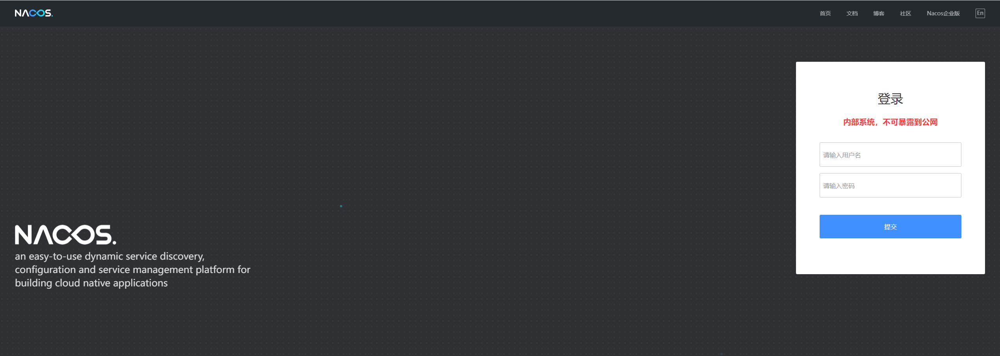
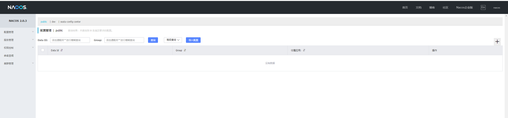
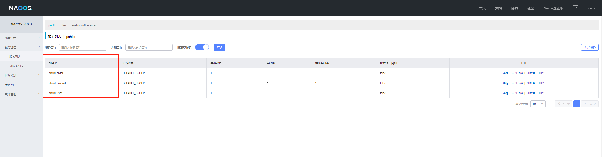
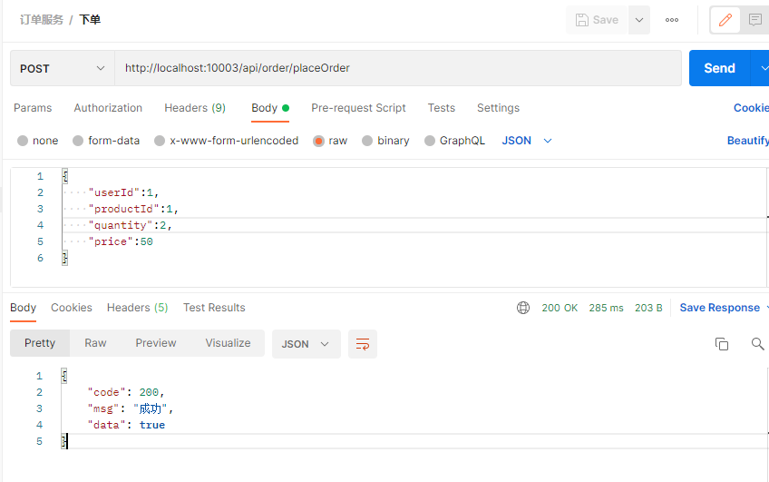
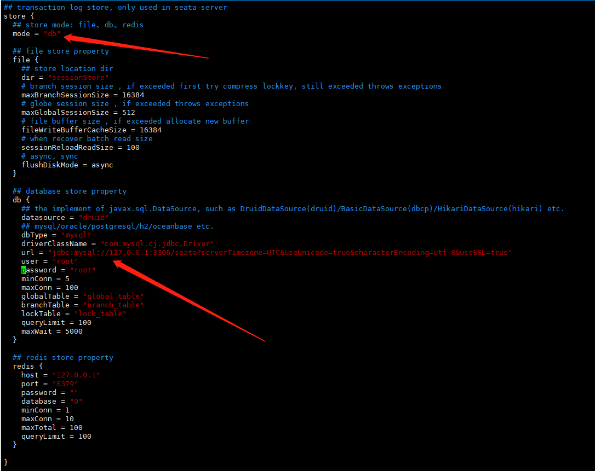
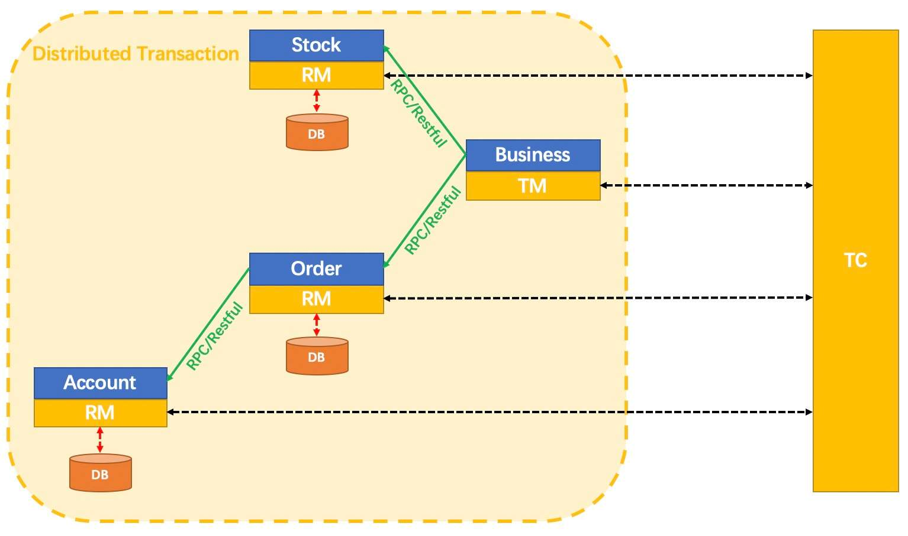
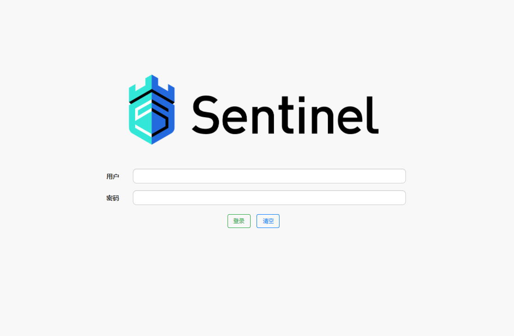
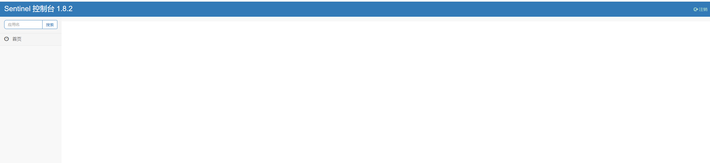
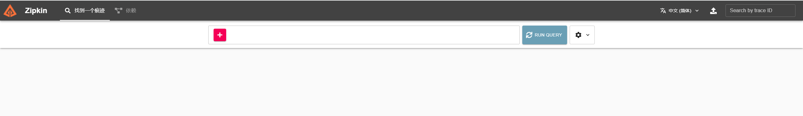
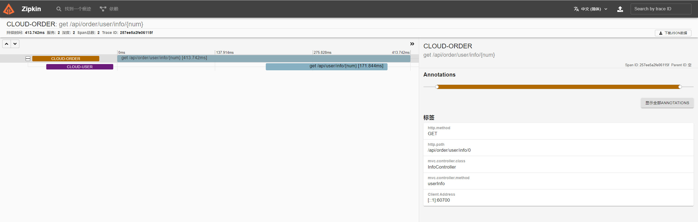

# explore-cloud-alibaba
探索 Spring Cloud 集成 Alibaba 

## 第一步: 配置父工程
```xml
<?xml version="1.0" encoding="UTF-8"?>
<project xmlns="http://maven.apache.org/POM/4.0.0"
         xmlns:xsi="http://www.w3.org/2001/XMLSchema-instance"
         xsi:schemaLocation="http://maven.apache.org/POM/4.0.0 http://maven.apache.org/xsd/maven-4.0.0.xsd">
    <modelVersion>4.0.0</modelVersion>

    <groupId>com.explore</groupId>
    <artifactId>explore-cloud-alibaba</artifactId>
    <version>1.0-SNAPSHOT</version>
    <modules>
        <module>cloud-user</module>
    </modules>
    <packaging>pom</packaging>

    <properties>
        <maven.compiler.source>8</maven.compiler.source>
        <maven.compiler.target>8</maven.compiler.target>
    </properties>


    <dependencies>

        <!-- Lombok 依赖 -->
        <dependency>
            <groupId>org.projectlombok</groupId>
            <artifactId>lombok</artifactId>
        </dependency>

    </dependencies>


    <dependencyManagement>

        <!-- Spring Boot 相关依赖 -->
        <dependencies>
            <dependency>
                <groupId>org.springframework.boot</groupId>
                <artifactId>spring-boot-dependencies</artifactId>
                <version>2.6.1</version>
                <type>pom</type>
                <scope>import</scope>
            </dependency>

            <!-- Spring Cloud 相关依赖 -->
            <dependency>
                <groupId>org.springframework.cloud</groupId>
                <artifactId>spring-cloud-dependencies</artifactId>
                <version>2021.0.0</version>
                <type>pom</type>
                <scope>import</scope>
            </dependency>

            <!-- Spring Cloud Alibaba 相关依赖 -->
            <dependency>
                <groupId>com.alibaba.cloud</groupId>
                <artifactId>spring-cloud-alibaba-dependencies</artifactId>
                <version>2021.1</version>
                <type>pom</type>
                <scope>import</scope>
            </dependency>

            <!-- MySql 驱动 -->
            <dependency>
                <groupId>mysql</groupId>
                <artifactId>mysql-connector-java</artifactId>
                <version>8.0.20</version>
            </dependency>

            <!-- Spring Boot Mybatis 相关依赖 -->
            <dependency>
                <groupId>org.mybatis.spring.boot</groupId>
                <artifactId>mybatis-spring-boot-starter</artifactId>
                <version>2.2.0</version>
            </dependency>

            <!-- 数据库连接池 -->
            <dependency>
                <groupId>com.alibaba</groupId>
                <artifactId>druid-spring-boot-starter</artifactId>
                <version>1.2.8</version>
            </dependency>

            <!-- 工程热部署依赖 -->
            <dependency>
                <groupId>org.springframework.boot</groupId>
                <artifactId>spring-boot-devtools</artifactId>
                <version>2.6.1</version>
            </dependency>

        </dependencies>

    </dependencyManagement>

    <build>
        <plugins>
            <plugin>
                <groupId>org.springframework.boot</groupId>
                <artifactId>spring-boot-maven-plugin</artifactId>
                <configuration>
                    <fork>true</fork>
                </configuration>
            </plugin>
        </plugins>
    </build>

</project>
```

## 第二步：创建子工程（普通的maven工程）

### 创建 cloud-user 子工程
#### 1. 创建maven工程


#### 2. 选择SDK


#### 3. 设置子工程名称


#### 4. 配置子工程中的相关依赖
```xml
<?xml version="1.0" encoding="UTF-8"?>
<project xmlns="http://maven.apache.org/POM/4.0.0"
         xmlns:xsi="http://www.w3.org/2001/XMLSchema-instance"
         xsi:schemaLocation="http://maven.apache.org/POM/4.0.0 http://maven.apache.org/xsd/maven-4.0.0.xsd">
    <parent>
        <artifactId>explore-cloud-alibaba</artifactId>
        <groupId>com.explore</groupId>
        <version>1.0-SNAPSHOT</version>
    </parent>
    <modelVersion>4.0.0</modelVersion>

    <artifactId>cloud-user</artifactId>

    <properties>
        <maven.compiler.source>8</maven.compiler.source>
        <maven.compiler.target>8</maven.compiler.target>
    </properties>

    <dependencies>

        <!-- web工程依赖 -->
        <dependency>
            <groupId>org.springframework.boot</groupId>
            <artifactId>spring-boot-starter-web</artifactId>
        </dependency>
        <!-- Spring Boot 程序监控器 -->
        <dependency>
            <groupId>org.springframework.boot</groupId>
            <artifactId>spring-boot-starter-actuator</artifactId>
        </dependency>

    </dependencies>

</project>
```

#### 5. 创建 application.yaml,并且配置服务名称与端口
```yaml
server:
  port: 10001

spring:
  application:
    name: cloud-user
```

#### 6. 创建 启动类 与 控制器类

##### 启动类 UserApplication
```java

package com.explore.user;

import org.springframework.boot.SpringApplication;
import org.springframework.boot.autoconfigure.SpringBootApplication;

/**
 * 用户服务 启动类
 *
 * @author: YuHaiQing
 * @time: 2022/2/1 18:40
 */
@SpringBootApplication
public class UserApplication {

    public static void main(String[] args) {
        SpringApplication.run(UserApplication.class,args);
    }

}
```

##### 控制器类 UserController
```java
package com.explore.user.controller;

import org.springframework.beans.factory.annotation.Value;
import org.springframework.web.bind.annotation.GetMapping;
import org.springframework.web.bind.annotation.RequestMapping;
import org.springframework.web.bind.annotation.RestController;

/**
 * 用户 控制器类
 *
 * @author: YuHaiQing
 * @time: 2022/2/1 18:40
 */
@RestController
@RequestMapping("/api/user")
public class UserController {

    @Value("${server.port}")
    private Integer port;

    @GetMapping("/info")
    public String info(){
        return "服务名称: cloud-user, 端口: " + port;
    }
    
}
```

#### 7. 启动 用户服务


#### 8. 访问接口


#### 9. 按照创建用户服务的步骤，创建 产品服务 与 订单服务


### 第三步：编写实体Bean，对象关系映射，连接数据源

#### 1. 创建实体Bean
```java
package com.explore.user.domain;

import com.fasterxml.jackson.annotation.JsonFormat;
import lombok.AllArgsConstructor;
import lombok.Data;
import lombok.NoArgsConstructor;

import java.io.Serializable;
import java.math.BigDecimal;
import java.time.LocalDateTime;

/**
 * 用户 实体类
 *
 * @author: YuHaiQing
 * @time: 2022/2/1 19:10
 */
@Data
@NoArgsConstructor
@AllArgsConstructor
public class User implements Serializable {

    /**
     * 主键
     */
    private Long Id;

    /**
     * 用户姓名
     */
    private String name;

    /**
     * 用户年龄
     */
    private Integer age;

    /**
     * 用户性别
     */
    private String sex;

    /**
     * 用户账户余额
     */
    private BigDecimal balance;

    /**
     * 创建时间
     */
    @JsonFormat(pattern = "yyyy-MM-dd HH:mm:ss")
    private LocalDateTime createTime;

    /**
     * 更新时间
     */
    @JsonFormat(pattern = "yyyy-MM-dd HH:mm:ss")
    private LocalDateTime updateTime;

}

```

#### 2. 创建 实体Bean对应的Mapper 接口
```java
package com.explore.user.mapper;

import com.explore.user.domain.User;
import org.apache.ibatis.annotations.Mapper;
import org.apache.ibatis.annotations.Param;

import java.math.BigDecimal;

/**
 * 用户映射器
 *
 * @author: YuHaiQing
 * @time: 2022/2/1 19:14
 */
@Mapper
public interface UserMapper {

    /**
     * 根据用户Id查询用户信息
     *
     * @param userId 用户Id
     *
     * @author: HaiQing.Yu
     * @time: 2022/2/1 19:15
     */
    User getById(@Param("userId") Long userId);

    /**
     * 扣余额
     *
     * @param userId 用户Id
     * @param money 扣款金额
     *
     * @author: HaiQing.Yu
     * @time: 2022/2/1 19:16
     */
    Integer reduction(@Param("userId") Long userId, @Param("money") BigDecimal money);

}
```

#### 3. 创建 Mapper接口对应的*Mapper.xml 文件
```xml
<?xml version="1.0" encoding="UTF-8"?>
<!DOCTYPE mapper PUBLIC "-//mybatis.org//DTD Mapper 3.0//EN" "http://mybatis.org/dtd/mybatis-3-mapper.dtd">

<mapper namespace="com.explore.user.mapper.UserMapper">

    <resultMap id="userMap" type="com.explore.user.domain.User">
        <id column="id" jdbcType="BIGINT" property="id" javaType="java.lang.Long" />
        <result column="name" jdbcType="VARCHAR" property="name" javaType="java.lang.String" />
        <result column="age" jdbcType="INTEGER" property="age" javaType="java.lang.Integer" />
        <result column="sex" jdbcType="VARCHAR" property="sex" javaType="java.lang.String" />
        <result column="balance" jdbcType="DECIMAL" property="balance" javaType="java.math.BigDecimal" />
        <result column="create_time" jdbcType="TIMESTAMP" property="createTime" javaType="java.time.LocalDateTime" />
        <result column="update_time" jdbcType="TIMESTAMP" property="updateTime" javaType="java.time.LocalDateTime" />
    </resultMap>
    
    <!-- 新增用户 -->
    <insert id="insert" useGeneratedKeys="true" keyColumn="id">
        insert into e_user (name,age,sex,balance,create_time,update_time) values (#{name},#{age},#{sex},#{balance},#{createTime},#{updateTime})
    </insert>

    <!-- 根据用户Id查询用户信息 -->
    <select id="findById" resultMap="userMap">
        select id,name,age,sex,balance,create_time,update_time from e_user where id = #{userId}
    </select>

    <!-- 扣款操作 -->
    <update id="deduction">
        update e_user set balance = balance - #{money} where id = #{userId}
    </update>

</mapper>
```

#### 4. 编写具体业务逻辑
```java
package com.explore.user.service;

import com.explore.user.domain.User;

import java.math.BigDecimal;

/**
 * 用户 业务逻辑接口类
 *
 * @author: HaiQing.Yu
 * @time: 2022/2/1 20:55
 */
public interface IUserService {

    /**
     * 根据用户Id查询用户信息
     *
     * @author: HaiQing.Yu
     * @time: 2022/2/1 20:56
     */
    User getById(Long userId);

    /**
     * 扣款
     *
     * @author: HaiQing.Yu
     * @time: 2022/2/1 20:57
     */
    Boolean reduction(Long userId, BigDecimal money);

}
```

```java
package com.explore.user.service.impl;

import com.explore.user.domain.User;
import com.explore.user.mapper.UserMapper;
import com.explore.user.service.IUserService;
import org.springframework.stereotype.Service;

import javax.annotation.Resource;
import java.math.BigDecimal;

/**
 * 用户服务 业务逻辑实现类
 *
 * @author: YuHaiQing
 * @time: 2022/2/1 20:57
 */
@Service
public class UserServiceImpl implements IUserService {

    @Resource
    private UserMapper userMapper;

    @Override
    public User getById(Long userId) {
        return userMapper.getById(userId);
    }

    @Override
    public Boolean reduction(Long userId, BigDecimal money) {

        Integer reduction = userMapper.reduction(userId, money);

        if(null != reduction && reduction > 0){
            return Boolean.TRUE;
        }
        return Boolean.FALSE;
    }
}
```

```java
package com.explore.user.controller;

import com.explore.user.domain.User;
import com.explore.user.service.IUserService;
import org.springframework.beans.factory.annotation.Value;
import org.springframework.web.bind.annotation.GetMapping;
import org.springframework.web.bind.annotation.PathVariable;
import org.springframework.web.bind.annotation.RequestMapping;
import org.springframework.web.bind.annotation.RestController;

import javax.annotation.Resource;

/**
 * 用户 控制器类
 *
 * @author: YuHaiQing
 * @time: 2022/2/1 18:40
 */
@RestController
@RequestMapping("/api/user")
public class UserController {

    @Value("${server.port}")
    private Integer port;

    @Resource
    private IUserService userService;

    @GetMapping("/info")
    public String info(){
        return "服务名称: cloud-user, 端口: " + port;
    }


    @GetMapping("/find/{userId}")
    public User getById(@PathVariable Long userId){
        return userService.getById(userId);
    }

}
```

#### 5. 编写配置文件
```yaml
server:
  port: 10001

spring:
  application:
    name: cloud-user
  datasource:
    druid:
      ################ 核心配置 ################
      url: jdbc:mysql://192.168.174.11:3306/explore_user?serverTimezone=UTC&useUnicode=true&characterEncoding=utf-8&useSSL=true
      username: root
      password: root
      driver-class-name: com.mysql.cj.jdbc.Driver
      ################ 可选配置 ################
      initial-size: 3
      min-idle: 3
      max-active: 10
      max-wait: 60000

logging:
  level:
    com.explore.user.mapper: debug
    
mybatis:
  type-aliases-package: com.explore.user.mapper
  mapper-locations: classpath:mapper/*.xml

```

#### 6. 测试


#### 7. 如上述操作完成 产品服务与用户服务的接入数据源

### 第四步：集成注册中心，Nacos

#### 1. 搭建注册中心
```shell
# a. 下载页面：https://github.com/alibaba/nacos/releases/download/2.0.3/nacos-server-2.0.3.tar.gz
# b. 解压并移动到 /usr/local/nacos 目录
# c. 进入/usr/local/nacos/bin | ./startup.sh  -m standalone, 启动单机版注册中心
```

##### 启动成功,访问Nacos(http://192.168.174.11:8848/nacos  账号：nacos  密码：nacos)




#### 2. 服务向注册中心进行注册

#### 添加注册中心依赖
```xml
<!-- 注册中心依赖 -->
<dependency>
    <groupId>com.alibaba.cloud</groupId>
    <artifactId>spring-cloud-starter-alibaba-nacos-discovery</artifactId>
</dependency>
```

#### 设置注册中心相关配置
```yaml
spring:
  cloud:
    nacos:
      discovery:
        server-addr: 192.168.174.11:8848
        username: nacos
        password: nacos
```

#### 启动类配置注解
```java
package com.explore.user;

import org.springframework.boot.SpringApplication;
import org.springframework.boot.autoconfigure.SpringBootApplication;
import org.springframework.cloud.client.discovery.EnableDiscoveryClient;

/**
 * 用户服务 启动类
 *
 * @author: YuHaiQing
 * @time: 2022/2/1 18:40
 */
@EnableDiscoveryClient  // 服务发现注解
@SpringBootApplication
public class UserApplication {

    public static void main(String[] args) {
        SpringApplication.run(UserApplication.class,args);
    }

}
```

#### 所有服务相关的注册中心配置完成，启动后，如下图可知，服务已经注册成功！


### 第五步：服务远程调用 - OpenFeign,负载均衡 - LoadBalancer

##### 1. 添加相关依赖
```xml
<!-- 远程调用，负载均衡依赖 -->
<dependency>
    <groupId>org.springframework.cloud</groupId>
    <artifactId>spring-cloud-starter-openfeign</artifactId>
</dependency>
<dependency>
    <groupId>org.springframework.cloud</groupId>
    <artifactId>spring-cloud-starter-loadbalancer</artifactId>
</dependency>
```

#### 2. 编写Feign接口
```java
package com.explore.order.feign;

import com.explore.user.domain.User;
import com.explore.user.dto.UserReductionRequest;
import org.springframework.cloud.openfeign.FeignClient;
import org.springframework.web.bind.annotation.GetMapping;
import org.springframework.web.bind.annotation.PathVariable;
import org.springframework.web.bind.annotation.PostMapping;
import org.springframework.web.bind.annotation.RequestBody;

/**
 * 调用三方接口类
 *
 * @author: HaiQing.Yu
 * @time: 2022/2/4 10:04
 */
@FeignClient(value = "cloud-user",path = "/api/user")
public interface IUserFeign {

    @GetMapping("/info")
    String info();

    @GetMapping("/find/{userId}")
    User getById(@PathVariable("userId") Long userId);

     @PostMapping("/reduction")
    Boolean reduction(@RequestBody UserReductionRequest request);
}

```

`该接口类是为了调用外部服务定义的接口`

#### 3. 配置启用OpenFeign注解
```java
package com.explore.order;

import org.springframework.boot.SpringApplication;
import org.springframework.boot.autoconfigure.SpringBootApplication;
import org.springframework.cloud.client.discovery.EnableDiscoveryClient;
import org.springframework.cloud.openfeign.EnableFeignClients;

/**
 * 订单服务 启动类
 *
 * @author: YuHaiQing
 * @time: 2022/2/1 18:56
 */
@EnableFeignClients     // 添加该注解,表示启用Feign
@EnableDiscoveryClient
@SpringBootApplication
public class OrderApplication {
    public static void main(String[] args) {
        SpringApplication.run(OrderApplication.class,args);
    }
}
```

#### 4. 使用Feign接口实现远程调用
```java
package com.explore.order.controller;

import com.explore.base.ResultResponse;
import com.explore.order.domain.Order;
import com.explore.order.feign.IProductFeign;
import com.explore.order.feign.IUserFeign;
import com.explore.order.service.IOrderService;
import com.explore.product.dto.ProductReductionRequest;
import com.explore.user.dto.UserReductionRequest;
import org.springframework.beans.factory.annotation.Autowired;
import org.springframework.beans.factory.annotation.Value;
import org.springframework.web.bind.annotation.*;

import javax.annotation.Resource;
import java.math.BigDecimal;
import java.time.LocalDateTime;

/**
 * 订单 控制器类
 *
 * @author: YuHaiQing
 * @time: 2022/2/1 18:57
 */
@RestController
@RequestMapping("/api/order")
public class OrderController {

    @Value("${server.port}")
    private Integer port;

    @Autowired
    private IOrderService orderService;
    @Resource
    private IUserFeign userFeign;
    @Resource
    private IProductFeign productFeign;


    @GetMapping("/info")
    public String Info(){
        return "服务名称: cloud-order, 服务端口: " + port;
    }


    /**
     * 下单业务
     *
     * @author: HaiQing.Yu
     * @time: 2022/2/1 22:25
     */
    @PostMapping("/placeOrder")
    public ResultResponse<Boolean> placeOrder(@RequestBody Order order){

        // 1. 创建订单
        order.setOrderNo("ECA" + System.currentTimeMillis());
        order.setCreateTime(LocalDateTime.now());
        Boolean createFlag = orderService.createOrder(order);
        if(!createFlag){
            return ResultResponse.error(444,"订单创建失败");
        }

        // 2. 用户扣款
        UserReductionRequest request = new UserReductionRequest();
        request.setUserId(order.getUserId());
        request.setMoney(order.getPrice().multiply(new BigDecimal(order.getQuantity())));
        Boolean reduction = userFeign.reduction(request);
        if(!reduction){
            return ResultResponse.error(444,"用户扣款失败");
        }

        // 3. 产品减库存
        ProductReductionRequest productRequest = new ProductReductionRequest();
        productRequest.setProductId(order.getProductId());
        productRequest.setQuantity(order.getQuantity());
        final Boolean pFlag = productFeign.reduction(productRequest);
        if(!pFlag){
            return ResultResponse.error(444,"产品减库存失败");
        }

        // 4. 更新订单状态
        final Boolean aBoolean = orderService.updateOrderStatus(order.getId(), Order.OrderStatus.complete.getStatus());
        if(!aBoolean){
            return ResultResponse.error(444,"更新订单状态失败");
        }

        return ResultResponse.success(Boolean.TRUE);
    }

}

```

#### 5. 调用结果


#### 6. 关于负载均衡
```text
OpenFeign 3.1.0版本，只需要引入LoadBalancer依赖，IUserFeign接口类中配置了服务名称即可，调用时会自动进行负载均衡，如需修改负载均衡策略，需额外配置。
```

### 第六步：分布式事务 Seata

#### Seata Server 部署
##### 1. 下载安装包
```shell
# 下载地址 https://github.com/seata/seata/releases
```

##### 2. 建表
```text
全局事务会话信息由3块内容构成:
    全局事务表：global_table
    分支事务表：branch_table
    全局锁表：lock_table
```

##### 3. 修改配置文件
```shell
# file.conf
store.mode: 设置数据源
store.db:配置数据库相关的配置

# registry.conf
1. 设置注册中心 registry,以便于其他服务可以使用Seata
2. 设置配置中心 config,Seata 相关配置保存在配置中心，启动时从配置中心加载

```



##### 4. 启动Seata Server
```shell

# 后台启动命令
nohup sh seata-server.sh -h 127.0.0.1 &

# -h: 注册到注册中心的ip
# -p: Server rpc 监听端口
# -m: 全局事务会话信息存储模式，file、db、redis，优先读取启动参数 (Seata-Server 1.3及以上版本支持redis)
# -n: Server node，多个Server时，需区分各自节点，用于生成不同区间的transactionId，以免冲突
# -e: 多环境配置参考 http://seata.io/en-us/docs/ops/multi-configuration-isolation.html

```


#### Seata Client集成

##### 1. 添加Seata依赖
```xml
<!-- 分布式事务依赖 Seata -->
<dependency>
    <groupId>com.alibaba.cloud</groupId>
    <artifactId>spring-cloud-starter-alibaba-seata</artifactId>
    <exclusions>
        <exclusion>
            <groupId>io.seata</groupId>
            <artifactId>seata-spring-boot-starter</artifactId>
        </exclusion>
    </exclusions>
</dependency>
<dependency>
    <groupId>io.seata</groupId>
    <artifactId>seata-spring-boot-starter</artifactId>
    <version>1.4.2</version>
</dependency>
```

##### 2. 配置Seata相关属性
```yaml
seata:
  enabled: true
  tx-service-group: cloud_order_tx_group
  registry:
    type: nacos
    nacos:
      server-addr: 192.168.174.11:8848
      namespace: 2b21d738-f843-46c5-9063-7c6413fb003a
      group: SEATA_GROUP
      application: seata-server
  config:
    type: nacos
    nacos:
      namespace: 2b21d738-f843-46c5-9063-7c6413fb003a
      group: SEATA_GROUP
      server-addr: 192.168.174.11:8848
```

#### 3. 启动类上添加注解
```java
package com.explore.order;

import org.springframework.boot.SpringApplication;
import org.springframework.boot.autoconfigure.SpringBootApplication;
import org.springframework.cloud.client.discovery.EnableDiscoveryClient;
import org.springframework.cloud.openfeign.EnableFeignClients;

/**
 * 订单服务 启动类
 *
 * @author: YuHaiQing
 * @time: 2022/2/1 18:56
 */
@EnableFeignClients         // 此注解为启用Feign
@EnableDiscoveryClient
@SpringBootApplication
public class OrderApplication {
    public static void main(String[] args) {
        SpringApplication.run(OrderApplication.class,args);
    }
}

```

#### 4. 分布式事务的两种场景

```yaml
# 第一种：不处理分布式事务
调用链中的其中一个服务宕机或不可用,都会导致此次调用失败，但对分布式进行事务处理，则会导致部分业务执行成功，部分业务执行失败，最终导致数据不一致问题


# 第二种：处理分布式事务,在调用的发起方添加注解 @GlobalTransactional
跨服务调用链中任何一个服务宕机或者服务熔断、降级，都能保存数据一致性
```

#### 5. 业务代码
```java
/**
 * 下单业务
 *
 * @author: HaiQing.Yu
 * @time: 2022/2/1 22:25
 */


/**
 * 订单 控制器类
 *
 * @author: YuHaiQing
 * @time: 2022/2/1 18:57
 */
@Slf4j
@RestController
@RequestMapping("/api/order")
public class OrderController {

    @Value("${server.port}")
    private Integer port;

    @Autowired
    private IOrderService orderService;
    @Resource
    private IUserFeign userFeign;
    @Resource
    private IProductFeign productFeign;
    
    @PostMapping("/placeOrder")
    @GlobalTransactional(rollbackFor = Exception.class)
    public ResultResponse<Boolean> placeOrder(@RequestBody Order order){

        try {
            // 1. 创建订单
            log.info("【下单】 - 【创建订单】 - 【开始】");
            order.setOrderNo("ECA" + System.currentTimeMillis());
            order.setCreateTime(LocalDateTime.now());
            Boolean createFlag = orderService.createOrder(order);
            log.info("【下单】 - 【创建订单】 - 【结束】, 结果:{}",createFlag);
            if(!createFlag){
                this.rollback();
                return ResultResponse.error(444,"订单创建失败");
            }

            // 2. 用户扣款
            log.info("【下单】 - 【用户扣款】 - 【开始】");
            UserReductionRequest request = new UserReductionRequest();
            request.setUserId(order.getUserId());
            request.setMoney(order.getPrice().multiply(new BigDecimal(order.getQuantity())));
            Boolean reduction = userFeign.reduction(request);
            log.info("【下单】 - 【用户扣款】 - 【结束】, 结果:{}",reduction);
            if(!reduction){
                this.rollback();
                return ResultResponse.error(444,"用户扣款失败");
            }

            // 3. 产品减库存
            log.info("【下单】 - 【产品减库存】 - 【开始】");
            ProductReductionRequest productRequest = new ProductReductionRequest();
            productRequest.setProductId(order.getProductId());
            productRequest.setQuantity(order.getQuantity());
            final Boolean pFlag = productFeign.reduction(productRequest);
            log.info("【下单】 - 【产品减库存】 - 【结束】, 结果:{}",pFlag);
            if(!pFlag){
                this.rollback();
                return ResultResponse.error(444,"产品减库存失败");
            }

            // 4. 更新订单状态
            log.info("【下单】 - 【更新订单状态】 - 【开始】");
            final Boolean aBoolean = orderService.updateOrderStatus(order.getId(), Order.OrderStatus.complete.getStatus());
            log.info("【下单】 - 【更新订单状态】 - 【结束】, 结果:{}",aBoolean);
            if(!aBoolean){
                this.rollback();
                return ResultResponse.error(444,"更新订单状态失败");
            }

        } catch (Exception exception) {
            this.rollback();
            return ResultResponse.error(444,"下单业务异常");
        }

        return ResultResponse.success(Boolean.TRUE);
    }


    /**
     * 手动指定全局事务回滚业务(非运行时异常以外的异常，调用此方法进行处理)
     *
     * @author: HaiQing.Yu
     * @time: 2022/2/4 18:57
     */
    private void rollback(){
        try {
            log.info("【下单】 - 【业务异常】 - 【回滚全局事务】 - 【开始】");
            final String xid = RootContext.getXID();
            final GlobalStatus rollback = TransactionManagerHolder.get().rollback(xid);
            log.info("【下单】 - 【业务异常】 - 【回滚全局事务】 - 【结束】, 结果:{}",rollback.toString());
        } catch (TransactionException e) {
            log.error("【下单业务】 - 【回滚全局事务】 - 【异常】,异常:{}",e.getMessage());
        }
    }
}

```

#### 6. 什么是Seata?

**什么是Seata?**

`Seata 是一款开源的分布式事务解决方案，致力于提供高性能和简单易用的分布式事务服务。Seata 将为用户提供了 AT、TCC、SAGA 和 XA 事务模式，为用户打造一站式的分布式解决方案。`




#### 7. 分布式事务原理

```
AT事务模式：
    前提:
        (1) 基于支持本地ACID(A原子性、C一致性、I隔离性、D持久性)事务的关系型数据库
        (2) Java应用,通过JDBC访问数据
        
    整体机制(两阶段提交):
        一阶段：业务数据和回滚日志记录在同一个本地事务中提交,释放本地锁和连接资源。
        二阶段：
            (1) 提交异步化,非常快速的完成
            (2) 回滚通过一阶段的回滚日志进行反向补偿
    
    写隔离：
        (1) 一阶段本地事务提交前，需要确保先拿到 全局锁。
        (2) 拿不到 全局锁,不能提交本地事务。
        (3) 拿 全局锁 的尝试被限制在一定范围内，超出范围将放弃,并且回滚本地事务,释放本地锁。
        
    读隔离：
        在数据库本地事务隔离级别 读已提交(Read Committed) 或以上的基础上,Seata(AT模式) 的默认全局隔离级别是 读未提交(Read Uncommitted)。
    
    
    
    
TCC模式：
    描述：一个分布式的全局事务，整体是 两阶段提交 的模型。全局事务是由若干分支事务组成的，分支事务要满足 两阶段提交 的模型要求,即需要每个分支事务都具有自己的：
        (1) 一阶段prepare行为
        (2) 二阶段 commit 或者 rollback 行为
    
    
    根据两阶段行为模式的不同，我们将分支事务划分为 Automatic (Branch) Transaction Mode 和 Manual (Branch) Transaction Mode.
    
    AT 模式基于 支持本地 ACID 事务 的 关系型数据库：
        (1) 一阶段 prepare 行为：在本地事务中，一并提交业务数据更新和相应回滚日志记录。
        (2) 二阶段 commit 行为：马上成功结束，自动 异步批量清理回滚日志。
        (3) 二阶段 rollback 行为：通过回滚日志，自动 生成补偿操作，完成数据回滚。
    相应的，TCC 模式，不依赖于底层数据资源的事务支持：
        (1) 一阶段 prepare 行为：调用 自定义 的 prepare 逻辑。
        (2) 二阶段 commit 行为：调用 自定义 的 commit 逻辑。
        (3) 二阶段 rollback 行为：调用 自定义 的 rollback 逻辑。
    

Saga模式：
    Saga模式是Seata提供的长事务解决方案，在Saga模式中,业务流程中每个参与者都提交本地事务,当出现某一个参与者失败则补偿前面已经成功的参与者，一阶段正向服务和二阶段补偿服务都由业务开发实现。
    
    适用场景：
        (1) 业务流程长、业务流程多
        (2) 参与者包含其它公司或遗留系统服务，无法提供 TCC 模式要求的三个接口
    
    优势：
        (1) 一阶段提交本地事务，无锁，高性能
        (2) 事件驱动架构，参与者可异步执行，高吞吐
        (3) 补偿服务易于实现
        
    缺点：
        (1) 不保证隔离性
    
    
TC - 事务协调者
    (1) 维护全局和分支事务的状态，驱动全局事务提交或回滚。
    
TM - 事务管理器
    (1) 定义全局事务的范围：开始全局事务、提交或回滚全局事务。
    
RM - 资源管理器
    (1) 管理分支事务处理的资源，与TC交谈以注册分支事务和报告分支事务的状态，并驱动分支事务提交或回滚。
    
```

### 第七步：集成Sentinel, 实现服务降级熔断、流量控制

#### 1. 安装Sentinel控制台
```shell
# 参考文档: https://sentinelguard.io/zh-cn/docs/dashboard.html
# 下载地址: https://github.com/alibaba/Sentinel/releases

# 执行启动命令
nohup java -jar sentinel-dashboard-1.8.2.jar &

```
##### 启动成功后访问控制台 http://192.168.174.11:8080/#/login
`默认 账号: nacos 密码: nacos`



#### 2. Sentinel 客户端配置

##### pom依赖
```xml
<!-- 服务熔断、降级、限流 依赖 -->
<dependency>
    <groupId>com.alibaba.cloud</groupId>
    <artifactId>spring-cloud-starter-alibaba-sentinel</artifactId>
</dependency>
```

#### application.yaml 配置
```yaml
spring:
  cloud:
    sentinel:
      transport:
        dashboard: 192.168.174.11:8080      # 与仪表盘交互，如果在控制台配置了相关规则，会推送到本服务
        port: 8719                          # 当前服务客户端 端口,如果当前端口存在则+1,直到端口未占用为止


# Feign 启用Sentinel实现服务降级、熔断
feign:
  sentinel:
    enabled: true

```

#### 业务实现

`Feign接口业务逻辑及配置`
```java
package com.explore.order.feign;

import com.explore.base.ResultResponse;
import com.explore.order.feign.fallback.UserFeignFallback;
import com.explore.user.domain.User;
import com.explore.user.dto.UserReductionRequest;
import org.springframework.cloud.openfeign.FeignClient;
import org.springframework.web.bind.annotation.GetMapping;
import org.springframework.web.bind.annotation.PathVariable;
import org.springframework.web.bind.annotation.PostMapping;
import org.springframework.web.bind.annotation.RequestBody;

/**
 * 调用三方接口类
 *
 * @author: HaiQing.Yu
 * @time: 2022/2/4 10:04
 */
@FeignClient(name = "cloud-user",path = "/api/user",fallback = UserFeignFallback.class)
public interface IUserFeign {

    @GetMapping(value = "/info/{num}")
    ResultResponse<String> info(@PathVariable("num") Integer num);

    @GetMapping("/find/{userId}")
    User getById(@PathVariable("userId") Long userId);

    @PostMapping("/reduction")
    Boolean reduction(@RequestBody UserReductionRequest request);
}


```

`服务降级处理`
```java
package com.explore.order.feign.fallback;

import com.explore.base.ResultResponse;
import com.explore.order.feign.IUserFeign;
import com.explore.user.domain.User;
import com.explore.user.dto.UserReductionRequest;
import org.springframework.stereotype.Component;
import org.springframework.web.bind.annotation.PathVariable;

/**
 * 用户服务 流量控制异常处理和服务降级处理
 *
 * @author: YuHaiQing
 * @time: 2022/2/4 21:53
 */
@Component
public class UserFeignFallback implements IUserFeign {

    @Override
    public ResultResponse<String> info(@PathVariable("num") Integer num) {
        return ResultResponse.error(555,"服务降级处理,o(╥﹏╥)o");
    }

    @Override
    public User getById(Long userId) {
        return null;
    }

    @Override
    public Boolean reduction(UserReductionRequest request) {
        return null;
    }
}

```

`流量控制 自定义异常处理`
```java
package com.explore.order.feign.fallback;

import com.alibaba.csp.sentinel.slots.block.BlockException;
import com.explore.base.ResultResponse;
import org.springframework.web.bind.annotation.PathVariable;

/**
 * 用户服务 流量控制处理
 *
 * @author: YuHaiQing
 * @time: 2022/2/4 22:27
 */
public class UserBlockHandler {

    /**
     * 用户服务流量控制
     *
     * @author: HaiQing.Yu
     * @time: 2022/2/4 22:28
     */
    public static ResultResponse<String> infoBlockHandler(@PathVariable("num") Integer num, BlockException exception) {
        return ResultResponse.error(555,"流量控制处理,╮(╯▽╰)╭");
    }
}
```

`Controller 业务逻辑`
```java
package com.explore.order.controller;

import com.alibaba.csp.sentinel.annotation.SentinelResource;
import com.explore.base.ResultResponse;
import com.explore.order.feign.IProductFeign;
import com.explore.order.feign.IUserFeign;
import com.explore.order.feign.fallback.UserBlockHandler;
import org.springframework.web.bind.annotation.GetMapping;
import org.springframework.web.bind.annotation.PathVariable;
import org.springframework.web.bind.annotation.RequestMapping;
import org.springframework.web.bind.annotation.RestController;

import javax.annotation.Resource;

/**
 * @author: YuHaiQing
 * @time: 2022/2/4 21:50
 */
@RestController
@RequestMapping("/api/order")
public class InfoController {

    @Resource
    private IUserFeign userFeign;
    @Resource
    private IProductFeign productFeign;

    /**
     * 用户服务信息
     *
     * @author: HaiQing.Yu
     * @time: 2022/2/4 21:51
     */
    @GetMapping("/user/info/{num}")
    @SentinelResource(value = "userInfo",blockHandler = "infoBlockHandler",blockHandlerClass = {UserBlockHandler.class})
    public ResultResponse userInfo(@PathVariable("num") Integer num){
        return userFeign.info(num);
    }


    /**
     * 用户服务信息
     *
     * @author: HaiQing.Yu
     * @time: 2022/2/4 21:51
     */
    @GetMapping("/product/info")
    @SentinelResource(value = "productInfo",blockHandler = "infoBlockHandler",blockHandlerClass = {UserBlockHandler.class})
    public ResultResponse productInfo(){
        return productFeign.info();
    }
}

```

### 第八步：服务链路跟踪(Sleuth<链路追踪器> + Zipkin<链路分析器>) 

#### 1. 安装链路分析器 Zipkin
```shell
# Zipkin下载地址: https://search.maven.org/search?q=a:zipkin-server ,zipkin-server-2.23.4-exec.jar

# 启动命令
nohup java -jar zipkin-server-2.23.4-exec.jar &
```
`启动成功,访问 http://192.168.174.11:9411/zipkin/`


#### 2. Zipkin 客户端集成
```xml
<!-- 微服务链路跟踪 spring-cloud-starter-sleuth 可省略,spring-cloud-starter-zipkin依赖包含了前者 -->
<dependency>
    <groupId>org.springframework.cloud</groupId>
    <artifactId>spring-cloud-starter-sleuth</artifactId>
</dependency>
<dependency>
    <groupId>org.springframework.cloud</groupId>
    <artifactId>spring-cloud-starter-zipkin</artifactId>
    <version>2.2.8.RELEASE</version>
</dependency>
```

`添加配置`
```yaml
spring:
  zipkin:
    base-url: http://192.168.174.11:9411
    discovery-client-enabled: false
  sleuth:
    sampler:
      probability: 1.0
```

`至此，服务链路跟踪搭建完成`


### 第九步：搭建微服务网关(Gateway)

#### 1. 引入依赖

```xml
    <dependencies>

        <dependency>
            <groupId>com.alibaba.cloud</groupId>
            <artifactId>spring-cloud-starter-alibaba-nacos-discovery</artifactId>
        </dependency>
        <dependency>
            <groupId>com.alibaba.cloud</groupId>
            <artifactId>spring-cloud-starter-alibaba-nacos-config</artifactId>
        </dependency>
        <dependency>
            <groupId>org.springframework.cloud</groupId>
            <artifactId>spring-cloud-starter-gateway</artifactId>
        </dependency>
        <dependency>
            <groupId>org.springframework.cloud</groupId>
            <artifactId>spring-cloud-starter-loadbalancer</artifactId>
        </dependency>
        <dependency>
            <groupId>com.alibaba.cloud</groupId>
            <artifactId>spring-cloud-starter-alibaba-sentinel</artifactId>
        </dependency>
        <dependency>
            <groupId>com.alibaba.cloud</groupId>
            <artifactId>spring-cloud-alibaba-sentinel-gateway</artifactId>
        </dependency>

    </dependencies>
```

#### 2. 编写配置
```yaml
server:
  port: 8888

spring:
  application:
    name: cloud-gateway
  main:
    allow-bean-definition-overriding: true
  cloud:
    nacos:
      discovery:
        server-addr: 192.168.174.11:8848
        namespace: 5f5b189f-1d18-4478-ad4e-e186e60310a8
        group: CLOUD_GROUP
    sentinel:
      transport:
        dashboard: 192.168.174.11:8080
        port: 8719
      eager: true # 取消Sentinel控制台懒加载,即项目启动即连接sentinel
#      scg:
#        fallback:
#          mode: response
#          response-status: 403
#          response-body: '{"code":403,"msg":"限流了"}'
    gateway:
      discovery:
        locator:
          enabled: true
          lower-case-service-id: true
      routes:
        - id: user_route
          uri: lb://cloud-user
          predicates:
            - Path=/api/user/**
        - id: product_route
          uri: lb://cloud-product
          predicates:
            - Path=/api/product/**
        - id: order_route
          uri: lb://cloud-order
          predicates:
            - Path=/api/order/**
          filters:
            - AddRequestHeader=X-Request-Author, HaiQing.Yu
```

#### 3. 创建网关启动类
```java
package com.explore.gateway;

import org.springframework.boot.SpringApplication;
import org.springframework.boot.autoconfigure.SpringBootApplication;
import org.springframework.cloud.client.discovery.EnableDiscoveryClient;

/**
 * 网关启动类
 *
 * @author: YuHaiQing
 * @time: 2022/2/4 23:34
 */
@EnableDiscoveryClient
@SpringBootApplication
public class GatewayApplication {
    public static void main(String[] args) {
        SpringApplication.run(GatewayApplication.class,args);
    }
}

```

#### 4. 自定义流量控制异常处理
```java
package com.explore.gateway.config;

import com.alibaba.csp.sentinel.adapter.gateway.common.rule.GatewayFlowRule;
import com.alibaba.csp.sentinel.adapter.gateway.common.rule.GatewayRuleManager;
import com.alibaba.csp.sentinel.adapter.gateway.sc.SentinelGatewayFilter;
import com.alibaba.csp.sentinel.adapter.gateway.sc.callback.BlockRequestHandler;
import com.alibaba.csp.sentinel.adapter.gateway.sc.callback.GatewayCallbackManager;
import com.alibaba.csp.sentinel.adapter.gateway.sc.exception.SentinelGatewayBlockExceptionHandler;
import org.springframework.beans.factory.ObjectProvider;
import org.springframework.cloud.gateway.filter.GlobalFilter;
import org.springframework.context.annotation.Bean;
import org.springframework.context.annotation.Configuration;
import org.springframework.core.annotation.Order;
import org.springframework.http.HttpStatus;
import org.springframework.http.MediaType;
import org.springframework.http.codec.ServerCodecConfigurer;
import org.springframework.web.reactive.function.BodyInserters;
import org.springframework.web.reactive.function.server.ServerResponse;
import org.springframework.web.reactive.result.view.ViewResolver;
import org.springframework.web.server.ServerWebExchange;
import reactor.core.publisher.Mono;

import javax.annotation.PostConstruct;
import java.util.*;

/**
 * 网关配置
 *
 * @author: YuHaiQing
 * @time: 2022/2/5 0:01
 */
@Configuration
public class GatewayConfig {


    private final List<ViewResolver> viewResolvers;
    private final ServerCodecConfigurer serverCodecConfigurer;

    public GatewayConfig(ObjectProvider<List<ViewResolver>> viewResolversProvider,
                         ServerCodecConfigurer serverCodecConfigurer) {
        this.viewResolvers = viewResolversProvider.getIfAvailable(Collections::emptyList);
        this.serverCodecConfigurer = serverCodecConfigurer;
    }

    @Bean
    @Order(-1)
    public SentinelGatewayBlockExceptionHandler sentinelGatewayBlockExceptionHandler() {
        // Register the block exception handler for Spring Cloud Gateway.
        return new SentinelGatewayBlockExceptionHandler(viewResolvers, serverCodecConfigurer);
    }

    @Bean
    @Order(-1)
    public GlobalFilter sentinelGatewayFilter() {
        return new SentinelGatewayFilter();
    }

//    @PostConstruct
//    public void initBlockHandler(){
//
//        BlockRequestHandler blockHandler = new BlockRequestHandler() {
//            @Override
//            public Mono<ServerResponse> handleRequest(ServerWebExchange serverWebExchange, Throwable throwable) {
//                Map<String,Object> map = new HashMap<>();
//                map.put("code",403);
//                map.put("msg","限流了");
//                return ServerResponse.status(HttpStatus.OK)
//                        .contentType(MediaType.APPLICATION_JSON)
//                        .body(BodyInserters.fromValue(map));
//            }
//        };
//
//        GatewayCallbackManager.setBlockHandler(blockHandler);
//
//    }

//    @PostConstruct
//    public void doInit() {
//        initGatewayRules();
//    }
//
//    /**
//     * 配置限流规则
//     */
//    private void initGatewayRules() {
//        Set<GatewayFlowRule> rules = new HashSet<>();
//        rules.add(new GatewayFlowRule("user_route")
//                .setCount(1) // 限流阈值
//                .setIntervalSec(1) // 统计时间窗口，单位是秒，默认是 1 秒
//        );
//        GatewayRuleManager.loadRules(rules);
//    }

}

```

### 第十步：集成注册中心( Nacos Config Center)

#### 1. 引入依赖
```xml
<!-- 配置中心 -->
<dependency>
    <groupId>com.alibaba.cloud</groupId>
    <artifactId>spring-cloud-starter-alibaba-nacos-config</artifactId>
</dependency>
<!-- 配置中心需要配置在bootstrap.yaml文件中,Spring Cloud 需要引入此配置才能使bootstrap.yaml生效 -->
<dependency>
    <groupId>org.springframework.cloud</groupId>
    <artifactId>spring-cloud-starter-bootstrap</artifactId>
</dependency>
```

#### 2. 编写配置
```yaml

# 读取配置中心中对应的配置文件 ${prefix}-${spring.profiles.active}.${file-extension}
# prefix 默认为 spring.application.name 的值，也可以通过配置项 spring.cloud.nacos.config.prefix来配置。
# spring.profiles.active 即为当前环境对应的 profile，详情可以参考 Spring Boot文档。 注意：当 spring.profiles.active 为空时，对应的连接符 - 也将不存在，dataId 的拼接格式变成 ${prefix}.${file-extension}
# file-exetension 为配置内容的数据格式，可以通过配置项 spring.cloud.nacos.config.file-extension 来配置。目前只支持 properties 和 yaml 类型。
spring:
  application:
    name: cloud-user
  profiles:
    active: dev
  main:
    allow-circular-references: true
  cloud:
    nacos:
      config:
        server-addr: 192.168.174.11:8848
        file-extension: yaml
        namespace: 5f5b189f-1d18-4478-ad4e-e186e60310a8
        group: CLOUD_GROUP
```

#### 3. 配置文件自动更新  @RefreshScope
```text
@RefreshScope
该注解
```